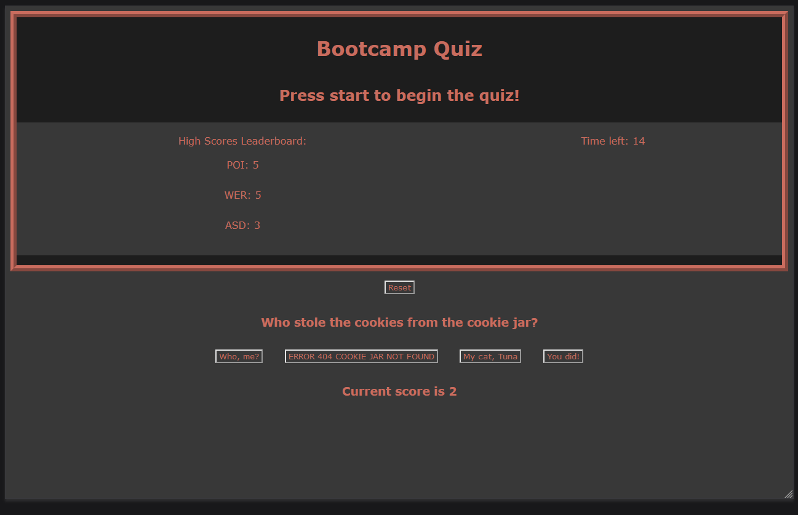

# Coding Quiz

  ## Description
  
A coding quiz to showcase some of the technologies I have learned.
  
  ## Table of Contents
  
  - [Installation](#installation)
  - [Usage](#usage)
  - [License](#license)
  - [Contributing](#contributing)
  - [Tests](#tests)
  - [Questions](#questions)
  
  
  
  ## Installation
  
Access the quiz from the github live page here: https://t0mwhite.github.io/Coding-Quiz/
  
  ## Usage
  

[Youtube Video of Application in Action](https://youtu.be/_vZhs4FsFUk)

  ## License

© Thomas White, 2021

[Coffeeware](https://github.com/Sonic853/coffeeware-license)
     License

        
  
  ## Contributing
  
Contact me by email.
  
  ## Tests
  
None
  
  ## Questions
  
Email me.
  
  #### Github
  
  https://github.com/T0mWhite
  
  #### Email
  
tbw2.mail@gmail.com
  
  
  

